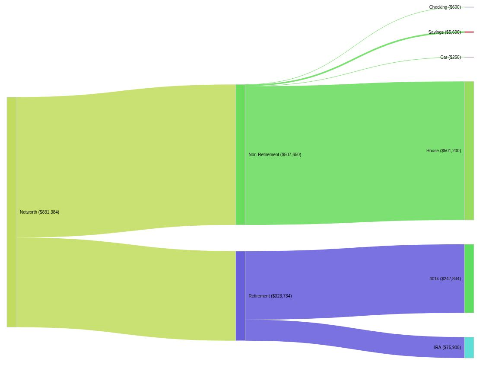

# Google Sheets Sankey  
Ever wanted to make a Sankey chart from your google sheets data and download it or insert it right into your sheets? This project is for you!



[See a sample sheet](https://docs.google.com/spreadsheets/d/1uppjSTXb_5Avjxmzj8oT1diHzL0W0uVlDwlnaPHn1pU/edit?usp=sharing)


> [!WARNING]
> This project was vibe coded, and is not without issues


## Installation
1. Open a google sheet
2. Click `Extensions` in the menu bar
3. Click `Apps Script` from the menu that appeared
4. Replace the contents of `Code.gs` with the one in this repository
5. Click the `+` to the right of `Files` in the left navigation bar, just above `Code.gs`
6. Select `HTML`
7. Enter `sankey` for the name
8. Replace the contents of `sankey.html` with the one in this repository


## Configuration
The configuration of this project is handled entirely in code for now. You start by defining your root in `CONFIG`, each item is required to have one of:
* `id` - Should be unique, used when creating the sankey chart
* `label` - A friendly name
* `sheet` - The sheet we're looking at for a value
* `col` - The column to find a value in

Optional attributes are:
* `alternate_label` - This is good if label has something sensitive it in you may want to hide when sharing
* `method` - The different ways to hunt for values in your sheet
* `children` - An array of more nodes

Here is the configuration from the linked sample spreadsheet above:
```
const CONFIG = {
  root: {
    id: 'NW',
    label: 'Networth',
    sheet: 'Sheet1', col: 'B', method: 'latestPositive',

    children: [
      {
        id: 'NonRet',
        label: 'Non-Retirement',
        sheet: 'Sheet4', col: 'F', method: 'latestPositive',

        children: [
          { id: 'Checking', label: 'Checking', alternate_label: 'Checking Account', sheet: 'Sheet4', col: 'B' },
          { id: 'Savings', label: 'Savings', alternate_label: 'Savings Account', sheet: 'Sheet4', col: 'C' },
          { id: 'Car', label: 'Car', alternate_label: 'Jalopy', sheet: 'Sheet4', col: 'D' },
          { id: 'House', label: 'House', alternate_label: 'Freemont Street Property', sheet: 'Sheet4', col: 'E' },
        ]
      },
      {
        id: 'Ret',
        label: 'Retirement',
        sheet: 'Investments', col: 'D', method: 'latestPositive',

        children: [
          {
            id: '401k',
            label: '401k',
            alternate_label: 'Work 401k',
            sheet: 'Investments', col: 'C', method: 'latestPositive'
          },
          {
            id: 'IRA',
            label: 'IRA',
            alternate_label: 'Traditional IRA',
            sheet: 'Investments', col: 'B', method: 'latestPositive'
          }
        ]
      }
    ]
  }
};
```

## Usage
If you've recently made changes in your apps script window, you need to hard refresh your google sheet. After that all you need to do is:
1. Click `Net Worth Sankey` in your menu bar
2. Click `Insert Diagram` in the menu that appears
3. Click your options in the dialog that appears
4. Click the button that corresponds to what you want to do with the chart

## Improvements
There are a number of improvements that could be made:
1. Don't close the dialog automatically in case someone wants to both insert and download
	2. Possibly make a setting with a menu/dialog for changing the setting for this behavior
2. Look at removing the need for an ID when creating the config
3. Find a way to make totals for a given node across multiple sheets
